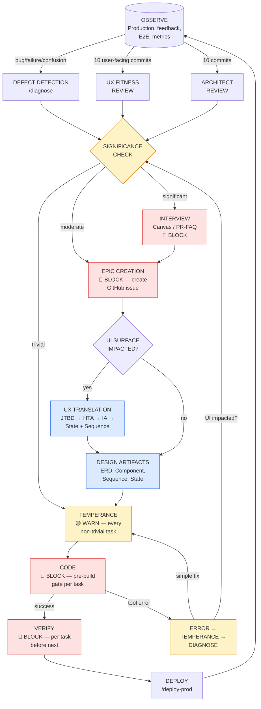

# SDLC Flow

## Philosophy

Build less. Ship what matters. Measure outcomes, not output.

Every initiative runs through the same lightweight process. The process exists to force clarity before code, not to create ceremony.

## Lifecycle

Each step drives increasing certainty in what to engineer.

```
Interview (open-ended discovery — why does this matter?)
  → Canvas: Thesis (5 min — what's the bet?)
    → Canvas: Shape (30 min — what's the value?)
      → Canvas: Commit (PR/FAQ, if scope warrants)
        → Design (structure + behavior — how does it work?)
          → Specs (what to build — requirements, acceptance criteria)
            → Spec Review (PR or doc review)
              → Epics / User Stories (work items in GitHub)
                → Implementation (feature branch)
                  → Code Review (PR)
                    → CI (automated pipeline)
                      → Deploy
                        → Observe
                          → [failure?] Diagnose (Is/Is Not → Five Whys → Hypothesis → Test)
                          → Retrospect (decision record if architectural)
```

## Process Map — Gates, Cycles, and Enforcement

The lifecycle above is the linear path. In practice, work enters through
multiple doors (defects, reviews, user feedback) and cycles through gates.
This map shows the full system with enforcement strength.



### Enforcement Strength

Every gate has an enforcement level. BLOCK means "do not proceed until
this is done." WARN means "consider this, state your decision, then proceed."

| Gate | Strength | When | What Must Happen |
|------|----------|------|-----------------|
| **Architect review** | 🔴 BLOCK | ≥10 commits since last | Task #1 in session. Report + tickets before any other work. |
| **Chronicle entry** | 🔴 BLOCK | Missing from previous session | Write before starting new work. |
| **Defect diagnosis** | 🔴 BLOCK | Bug/failure keywords in prompt | Is/Is Not + Five Whys before any fix code. |
| **Significance check** | 🔴 BLOCK | After any finding (defect, review, fitness) | Classify trivial/moderate/significant. Moderate+ creates epic. |
| **Epic creation** | 🔴 BLOCK | Significance = moderate or above | GitHub issue with design checklist before proceeding. |
| **Pre-build gate** | 🔴 BLOCK | Every Edit/Write of source file, every task | SDLC checkpoint + env check + test plan. |
| **Post-build verify** | 🔴 BLOCK | After each task, before next | Verification matched to change type. |
| **Temperance** | 🟡 WARN | Before every non-trivial implementation | Simplest approach? Brute-forcing? Blast radius? |
| **UX fitness** | 🟡 WARN | ≥10 user-facing commits | IA matches implementation? Entities have surfaces? |
| **UI surface check** | 🟡 WARN | On defect/arch/error paths | Does this change impact a user-facing surface? |
| **Error → temperance → diagnose** | 🔴 BLOCK | Tool call returns error | No retry until diagnosis written. |

### Significance Check Criteria

| Level | Criteria | Required Action |
|-------|----------|----------------|
| **Trivial** | < 30 min fix, no new objects, no UI change, no state change | Proceed to temperance → code. Log in commit message. |
| **Moderate** | New behavior, touches existing flow, UI change, new test needed | 🔴 Create GitHub issue with design checklist. Then design → code. |
| **Significant** | New entity, new user-facing surface, architectural change, multi-session scope | 🔴 Create GitHub issue. Run interview/canvas before design. |

### Cycles

The map has five recurring cycles:

1. **Defect cycle**: Observe → Defect → Significance → Epic → Design → Code → Deploy → Observe
2. **Architecture cycle**: Observe → Arch Review → Significance → Epic → Design → Code → Deploy → Observe
3. **UX fitness cycle**: Observe → UX Fitness → Significance → Epic → UX Translation → Design → Code → Deploy → Observe
4. **Hot fix cycle**: Observe → Defect → Significance (trivial) → Temperance → Code → Deploy → Observe
5. **Build error cycle**: Code → Error → Temperance → Diagnose → (back to Significance if UI impacted, else back to Code)

## Standards Applied at Each Step

The SDLC is the sequence. These are the standards that apply at each step.
Check the relevant docs before proceeding — they are not optional reading.

| Step | Apply |
|---|---|
| **Design** | `design/engineering-principles.md` (always) · `design/ai-design-guidelines.md` (if AI features) · `design/design-principles.md` (if UI) · `design/trust-zone-flow.md` (if agents or secrets) · `design/object-model.md` (if new objects) · UX Translation Chain (if user-facing surface — see Design Step below) |
| **Specs** | `strategy/templates/spec-template.md` |
| **Implementation** | `standards/testing-requirements.md` · `standards/security-scanning.md` · `standards/branching-strategy.md` · `standards/commit-conventions.md` · `design/component-patterns.md` (if UI) |
| **Code Review / CI** | `standards/security-scanning.md` (CI gate) |
| **Diagnose** (on failure) | `standards/diagnosis.md` |
| **Session start/end** | `strategy/session-continuity.md` |

**SDLC checkpoint is a mandatory pre-build gate.** Before starting any
implementation, identify where the initiative sits in the lifecycle above
and confirm all upstream steps are complete. Do not proceed to build
without this check.

---

### Design Step

Between Canvas/PR-FAQ and Specs, produce design diagrams that reduce
ambiguity about structure and behavior. All diagrams use Mermaid and
live in `docs/design/`.

| Diagram | Shows | When it earns its keep |
|---------|-------|----------------------|
| **ERD** (from Prisma schema) | Entity relationships, cardinality | Always — if you have a schema, render it |
| **Use Case** | Actor/action authorization boundaries | When multiple roles interact differently |
| **Component** | System components + external services | When there are async workers, queues, or external APIs |
| **Deployment** | Infrastructure layout, ports, networking | When deploying alongside other services |
| **Sequence** | Async flows, event chains, handoffs | When there are queues, agents, or multi-step automations |
| **Activity** | Branching logic, decision trees | When a pipeline has conditional paths |
| **State** | Object lifecycle transitions | When an entity has a status workflow |

### State Diagrams in Agentic Systems

State diagrams are **first-class** in any system with autonomous agents.
They define the **contract** between agents and the objects they act on:

- **Which transitions each agent is allowed to make.** The Scorer can
  transition NEW → SCORED but not SCORED → SHORTLISTED. Without this,
  agents do whatever they want.
- **Which transitions require human approval.** Any transition past SCORED
  needs an OPERATOR. The state diagram makes the automation boundary explicit.
- **What the valid recovery paths are.** Can a REJECTED deal be reconsidered?
  The state diagram answers this, not the code.

For agentic systems, produce a state diagram for every entity that:
1. Has a status/lifecycle enum
2. Is acted on by autonomous agents
3. Has transitions that require different authorization levels

These diagrams are not documentation — they are **specifications** that the
agent implementation must enforce.

Not every initiative needs all seven diagram types. Use the table to decide:
- **Operator scope, simple**: ERD + maybe a sequence. Skip the rest.
- **Operator scope, agentic/async**: ERD + Component + Sequence + Activity + State (required).
- **Domain/Product scope**: All that apply.

### UX Translation Chain

When an initiative has a **user-facing surface** (pages, interactions, flows),
run the UX translation chain during the Design step — concurrent with the
diagrams above, not after them.

```
JTBD → Task Analysis (HTA/CTA) → Entity Model → State Diagrams → Sequence Diagrams
                                       ↕                ↕
                                 IA (nav, screens)    Interaction Design
```

The chain produces artifacts that **co-derive** with the design diagrams:
- Entity model informs the ERD (and vice versa)
- State diagrams serve both agent boundaries and UI states
- Sequence diagrams show both backend flows and user ↔ UI ↔ API choreography

| Step | Method | Output |
|------|--------|--------|
| **JTBD → Tasks** | Hierarchical Task Analysis (HTA) for sequential work. Cognitive Task Analysis (CTA) for judgment-heavy work — adds decision points, mental models, expertise cues. | Task flow per JTBD with branch points. |
| **Tasks → Scenarios** | User stories with JTBD traceability. Every story traces to a job. If it can't, question whether it belongs. | Stories + traceability matrix. |
| **Entity Model → IA** | Entity inventory from schema + task analysis. OOUX: each primary entity gets list + detail views. IA from entity relationships (Morville: organization, labeling, navigation, search). | Screen map, nav structure. |
| **IA → Interaction** | UML State Diagrams (most rigorous — catches edge cases). UML Sequence Diagrams (handoff to engineering). User flows (stakeholder alignment). | State diagrams, sequence diagrams, edge case coverage. |

**The standard**: JTBD → HTA → UML State Diagrams → UML Sequence Diagrams,
with IA falling out of entity modeling in between. (Cooper, Norman, Larman.)

**Design system convention**: UI components built on top of shadcn primitives
should be named after **domain objects** (DealCard, ScorePills, ThesisFilter),
not generic UI concepts (Card, Badge, Tabs). The copy/language system serves
as the shared vocabulary layer — see Connolly's Full Stack Design System
principle: "the same language from code to customer."

### UX Fitness Review

UX artifacts are **living documents** that decay as implementation diverges
from design. Check them on an ongoing basis:

| Trigger | What to Check | Re-entry Point |
|---------|--------------|----------------|
| New Prisma model | Does this entity need a UI surface? Does nav change? | Entity model → IA |
| New page route created | State diagram for this page? Edge cases? | Interaction design |
| Existing flow changes behavior | State diagram transitions still accurate? | Interaction design |
| New user role or persona | Different jobs? Different task flows? | JTBD → full chain |
| User reports "confusing" / "can't find X" | HTA matches user's mental model? | Task analysis |
| Periodic (every 10 user-facing commits) | IA matches implementation? | Entity model → IA |

### Core Loop / Flywheel in Agentic Systems

When a system has **two or more agents that hand off to each other**,
it has a core loop. The test: does output from one agent become input
to another? If yes, map the loop before building any individual agent.

**What defines an agent** (vs. a tool or a function):
- Has a **trigger** (schedule, event, or human request)
- Has **authority** to act on objects (bounded by state diagrams)
- Has **decision-making** capability (rules, LLM, or both)
- Produces **side effects** (writes to DB, sends email, enqueues jobs)

A tool is a capability that gets called. An agent decides when and
how to use tools. The scraper *tool* parses HTML. The scraper *agent*
decides when to run, which states to scrape, and what to do with results.

**When to design the core loop:**
- Triggered during the Design step, any time the system includes 2+ agents
- Must be the **first activity diagram produced** — it's the map that
  shows how all other diagrams relate to each other
- Each segment of the loop should reference its detailed diagram
  (sequence, activity, state)

**How the core loop is used after design:**
- Referenced in every session Reflect phase — "which segment is weakest?"
- Includes a **status tracker** (green/yellow/red per segment) that's
  updated as the system matures
- Prioritization follows the loop: advance the weakest segment, not
  the one that's easiest or most interesting

Example (POA deal pipeline):
```
Data (scrape) → Analysis (score) → Communication (digest) → Decision (shortlist) → Feedback (refine) → Data
```

### Diagnosis Step

→ See **`standards/diagnosis.md`** for the full technique (Is/Is Not,
Five Whys, Hypothesis + Test format).

### Agentic Flywheel: Separation of Concerns

→ See **`design/engineering-principles.md`** — "Agentic Flywheel" section.
Triggered any time a Design step produces a flywheel diagram with 2+ agents.

### Object Model

New objects introduced by any initiative must be registered in the
shared object model (`platform-docs/design/object-model.md`) before
specs are written. This prevents naming drift across repos.

## Rules

1. **Nothing gets built without a work item.** See "Deterministic Epic Creation" — the significance check enforces this. Trivial fixes log in commit messages; everything else creates an issue first.
2. No work item over size M ships without a spec.
3. Specs are reviewed before code starts.
4. Design diagrams are produced before specs for any initiative with async flows or multiple components.
5. Every merge to main is deployable.
6. Outcomes are measured, not just shipped.
7. **Material backlog items trigger design review.** When a ticket introduces
   new objects, agents, state machines, or external integrations, it must
   include a "Design artifacts needed" checklist before implementation begins.
   This applies even when the ticket originates as a task or idea mid-session
   rather than through the formal Canvas → Spec flow. The checklist should
   identify which artifacts need updating: object model, state diagrams,
   sequence diagrams, specs. The ticket itself is the trigger — not the
   formality of the intake path.
8. **UX artifacts are living documents.** When implementation changes entities,
   pages, flows, or navigation, check the UX translation artifacts (task
   analysis, entity model, state diagrams, IA) for drift. Periodic fitness
   reviews catch what file-level checks miss. The pre-build gate checks for
   stale artifacts; the UX fitness review (every 10 user-facing commits)
   checks for structural drift.

## Deterministic Epic Creation

Work enters the system through multiple doors (defects, reviews, user
feedback, mid-session ideas). Every finding must be logged — not as a
discretionary choice, but as a mandatory output of the significance check.

**Why deterministic**: Unlogged work is invisible work. You can't prioritize,
measure, coordinate, or audit what doesn't exist as a work item. Deterministic
creation enables: traceability (code → epic → finding), DORA metrics (need the
denominator), multi-agent coordination (shared backlog as memory), prioritization
(compete explicitly), audit trail (decisions taken AND not taken), scope control
(epics define boundaries).

### When Epics Are Created

| Trigger | Significance | Required Output |
|---------|-------------|-----------------|
| Defect diagnosis identifies root cause | Moderate+ | GitHub issue before fix code |
| Architect review finding | Always | Issue per finding (batched OK) |
| UX fitness review drift | Moderate+ | Issue with IA update scope |
| Mid-session requirement surfaces | Moderate+ | Issue or checkbox on existing issue |
| Build error reveals design gap | Moderate+ | Issue if fix needs design work |
| User explicitly requests | Always | Issue |

### When Epics Are NOT Created

| Trigger | Significance | What Happens Instead |
|---------|-------------|---------------------|
| Trivial fix (typo, config, < 30 min) | Trivial | Log in commit message what was found and why no epic |
| Duplicate of existing issue | N/A | Comment on existing issue |
| Design discussion (not a finding) | N/A | Save to memory or docs, not backlog |

### Epic Minimum Content

Every epic must include:
1. **What**: description of the finding or need
2. **Why**: which trigger created it (defect, review, fitness, user request)
3. **Design checklist**: which artifacts need creating or updating
4. **UI surface**: does this touch a user-facing surface? (yes → UX translation needed)

### Audit Trail for Decisions NOT Taken

When significance check says "trivial — no epic needed," log that decision
in the commit message: "Found X, assessed as trivial because Y." This
prevents the pattern where small things become big problems and nobody
remembers seeing them.

## Cadence

For solo operators or small teams without sprint accountability:

- **Weekly review:** Look at the board. What shipped? What's stuck? What's next?
- **Milestones:** Time-boxed goals. Not deadlines — forcing functions for scope.
- **Decision records:** Written when you make a decision you'll forget in 3 months.

For teams with sprint cadence: map milestones to iterations. The canvas and spec workflow sits upstream of sprint planning.

## Auto-Complete / Danger Mode

When running with `--dangerously-skip-permissions` (or any future
Anthropic auto-complete mode that reduces human-in-the-loop oversight),
the audit trail must compensate for reduced oversight:

**Danger Mode Summaries** (`docs/danger-mode-summaries/YYYY-MM-DD.md`):
- Written incrementally during the session, not just at the end
- Captures: files changed (with why), tickets processed (status transitions),
  decisions made, tests added/removed, commits produced
- Compact, not verbose — the audit is the point, not the narrative
- Committed to git periodically during long sessions

**When to use danger mode:**
- Production deployments with known-good patterns
- Bulk implementation of well-specified stories
- Routine maintenance (dependency updates, migrations)

**When NOT to use danger mode:**
- Architectural decisions (need discussion before action)
- Schema changes (irreversible in production)
- Any work touching auth, secrets, or deletion logic

**The contract:** Velocity increases, but so does the documentation
obligation. Every file touched, every ticket moved, every decision
made — logged. The summary is the audit trail that makes velocity
safe.

## Session Chronicles

Every session produces a chronicle entry in `platform-docs/chronicle/`.
Chronicles are the narrative record of what was built, what was learned,
how the SDLC evolved, and what skills were demonstrated.

**Chronicle structure:**
- Frontmatter: date, duration, repos, tags, skills
- What shipped
- What was learned
- SDLC evolution (process changes during the session)
- Collaboration model (how human + AI divided the work)
- 3 post titles with 1-paragraph summaries (LinkedIn, Viva Engage, blog)

**When to write:**
- At the end of every session (manual until scribe agent ships)
- The agent is responsible for producing the draft; the human reviews

**Chronicles vs danger mode summaries:**
- Danger mode summaries = compact audit trail (what changed, what moved)
- Chronicles = narrative record (what was learned, what it means)
- Both are produced when running in danger mode

## Documentation as Byproduct

| Layer | What | When updated |
|-------|------|--------------|
| Decision records (ADRs) | Why decisions were made | When you make a decision |
| Specs | What gets built and why | Before implementation |
| Danger mode summaries | What changed in auto-complete sessions | During danger mode sessions |
| Session chronicles | What happened, what was learned, post ideas | Every session end |
| Changelog | What shipped | Every merge to main |
| README | What this is, how to run it | When setup changes |

If you follow the flow, documentation writes itself. If you're writing standalone docs, something is wrong with the process.
